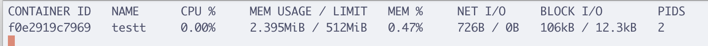
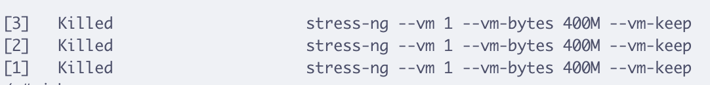
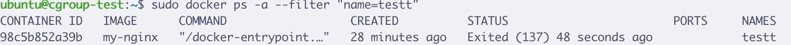

# Container and CGroups

##### **Obiettivo:**  - Lanciare un container all’interno di un host/vm Linux impostando una restrizione sulla memoria. - Lanciare il comando free all’interno del container e prendere nota della memoria attualmente occupata. - Impostare un memory.max inferiore alla memoria attualmente utilizzata fino a triggerare l’uccisione del container da parte dell’OOM killer del kernel (Out Of Memory).

#### Procedimento svolto
*Dopo aver runnato il container con la flag -m=512m per impostare la memoria massima a 512MB ho aperto 3 terminali:*
* Nel primo ho lanciato `docker stats` sul container per monitorare in tempo reale Memory Usage e Limit.
* Nel secondo sono entrata dentro al container per verificare la memoria con `free -b` (perchè nel file memory.max la memoria è espressa in bytes) e per lanciare una serie di processi con il comando `stress-ng --vm 1 --vm-bytes 610M --vm-keep &`, che allocano memoria senza liberarla per portare al massimo il Memory Usage.
* Il terzo terminale l'ho usato per cambiare dinamicamente il valore di memory.max e anche per visualizzare i messaggi del kernel relativi alla memoria con `dmesg | grep "out of memory"`

#### Considerazioni
Quello che ho notato è che il kernel tenta di mantenere attivo il container il più possibile e lo fa uccidendo i processi singoli in sequenza ogni volta che viene superato il limite imposto in memory.max. Quindi l'OOM killer interviene sui singoli processi per liberare progressivamente la memoria e mantenerla bilanciata. Anche diminuendo a poco a poco dinamicamente il valore in memory.max sotto la quantità di memoria richiesta dai processi non ho riscontrato un OOM killer dell'intero sistema ma un continuo suo adattamento, eventualmente bilanciando i processi in memoria.
L'uccisione da parte dell'OOM killer del container è immediata solo quando imposto un valore molto basso in memory.max dopo aver lanciato i processi (es. 20mb) --> Il risultato che ho ottenuto è stato lo stop immediato del container e facendo un docker ps -a il codice di uscita è 137, che si verifica appunto quando il container viene terminato dal kernel a causa dell'OOM killer per aver superato il limite di memoria assegnato.

----------------------------------------------------------------------------------------------------------------------------------------
## About CGroups

I CGroups (o control groups) sono una feature del kernel di Linux che consente di limitare l'utilizzo delle risorse (ram, cpu, io, etc...) da parte di un processo.
I limiti imposti su ogni cgroup vengono esposti dal kernel di Linux attraverso il path /sys/fs/cgroup nel filesystem /sys. Ad esempio per un container Docker li troveremo all’interno del path `/sys/fs/cgroup/system.slice/docker-<id>.scope` dove <id> è l’identificativo del container che viene visualizzato allo start.
La memoria massima assegnabile ad un cgroup è rappresentata dal file **memory.max** all’interno di questo path. Tale parametro è quello che viene impostato da Docker con l’opzione `—memory=<N>` al momento del run. E’ un file scrivibile pertando può essere modificato dinamicamente.
