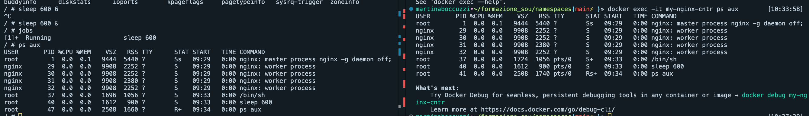

# Docker and namespaces

**Obiettivo:** Riuscire a lanciare un processo con lo stesso namespace di un container e visualizzare tale processo con una ps dentro al container. 

1. Creare Dockerfile per buildare l'immagine
	`docker built -t my-nginx-img .`

2. Runnare il container con le flag -d e -p per il mapping delle porte:
	`docker run -d -p 8080:80 --name my-nginx-cntr my-nginx-img`

3. Ottenere il PID del container
	`docker inspect my-nginx-cntr | grep Pid`

4. Lanciare un altro container con nsenter che si agganci a tutti i namespace del container nginx:
	`docker run -v /:/host --pid=host --privileged --rm -it jpetazzo/nsenter nsenter --target $PID --mount --uts --ipc --net --pid -- /bin/sh`
	* Spiegazione del comando:
		* `/:/host --pid=host` servono per simulare l'ambiente dell'host all'interno del container (nsenter non disponibile per MacOS)
		* `--privileged` concede al container privilegi necessari per agganciarsi ai namespace del processo di destinazione
		* `jpetazzo/nsenter` è l'immagine Docker che ho usato che contiene il comando nsenter
		* `--target $PID` specifica il PID del processo di destinazione, ossia il processo principale del container con nginx
		* `--mount --uts --ipc --net --pid` sono flag per aggiungere i namespaces al processo target
		* `-- /bin/sh` esegue la shell sh all'interno del container e quindi di fatto avvia un processo

5. Lanciare un altro processo dall'interno del container host (non necessario I know):
	`sleep 600 &`

6. Verificare dal container con nginx che il processo sia visibile:
	`docker exec -it my-nginx-cntr ps aux`

* Il PID del processo lanciato è uguale o diverso tra dentro e fuori il  container?
	Come visibile dall'immagine sopra, il PID del processo lanciato (sleep 600) è lo stesso perchè nsenter si aggancia al namespace
	dei PID del container target (my-nginx-cntr) e dunque il processo è come se fosse eseguito da lì.
	Inoltre anche il processo /bin/sh eseguito dal container host è visibile ed ha lo stesso PID sul container target.

* Cosa succede se si prova a stoppare il container mentre il processo creato è ancora attivo ?
	Se stoppo il container target a processo attivo, questo viene terminato poichè Docker gestisce i namespace del container e dunque fermandolo,
	libera e termina anche i suoi namespaces, così come tutti i processi associati, inclusi quelli avviati con nsenter (quindi /bin/sh e sleep 600).

* Cosa succede se si prova a killare il processo da dentro il container ?
	Se killo il processo dal container target questo viene terminato poichè kill invia un segnale al processo attivo nel namespace dei PID del container target,
	e dunque effettivamente uccide il processo.
